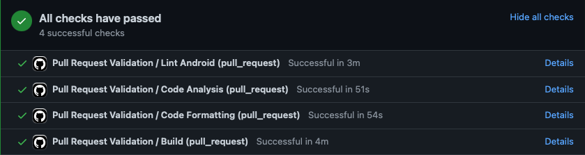

# DeliveryChallenge 
[](https://github.com/levezf/delivery-challenge/actions/workflows/generate_release.yml)
[](https://github.com/levezf/delivery-challenge/actions/workflows/pull_request.yml)

## Descrição do Projeto

Esse projeto foi desenvolvido como desafio de um processo seletivo da Luizalabs.

O projeto foi desenvolvido utilizando a arquitetura MVVM e faz uso de tenologias como: Retrofit, RoomDatabase, SQLite, Coroutines e Flow.

### Funcionalidades

As seguintes funcionalidades estão disponíveis na aplicação:
- [x] Cadastro de entregas
- [x] Edição de entregas
- [x] Remoção de entregas
- [x] Visualização das entregas

### Como rodar o projeto

Para compilar uma APK de debug, execute o comando abaixo na raíz do projeto.
```sh
./gradlew assembleDebug
```
> **Note**
> APKs de relase só serão geradas via CI pelo fluxo de geração de release.

Para instalar a APK em deu dispositivo, utilize o comando abaixo:
```sh
adb install app-debug.apk
```
> **Note**
> Para o comando funcionar é necessário que tenha o adb instalado corretamente
> e esteja no local do arquivo app-debug.apk. Ainda, é necessário que o dispositivo 
> esteja conectado ao computador e com o modo de depuração ativado.

Para verificar a formatação de código execute o comando abaixo na raíz do projeto.
```sh
./gradlew ktlintCheck
```

Para verificar o lint android execute o comando abaixo na raíz do projeto.
```sh
./gradlew lintDebug
```

Para executar a análise estática do código execute o comando abaixo na raíz do projeto.
```sh
./gradlew detekt
```

### CI

O CI, com Github Actions, conta com validações na PR e automações na geração de release.

As seguintes validações estão disponíveis nas Pull Requests:
- [x] Validação de formatação de código
- [x] Validação de lint android
- [x] Análise estática de código kotlin
- [x] Build da versão de debug do projeto
- [] Cobertura mínima de testes



Para a release foi criado uma automação para gerar o changelog automaticamente e, também,
gerar e publicar os artefatos do app.


